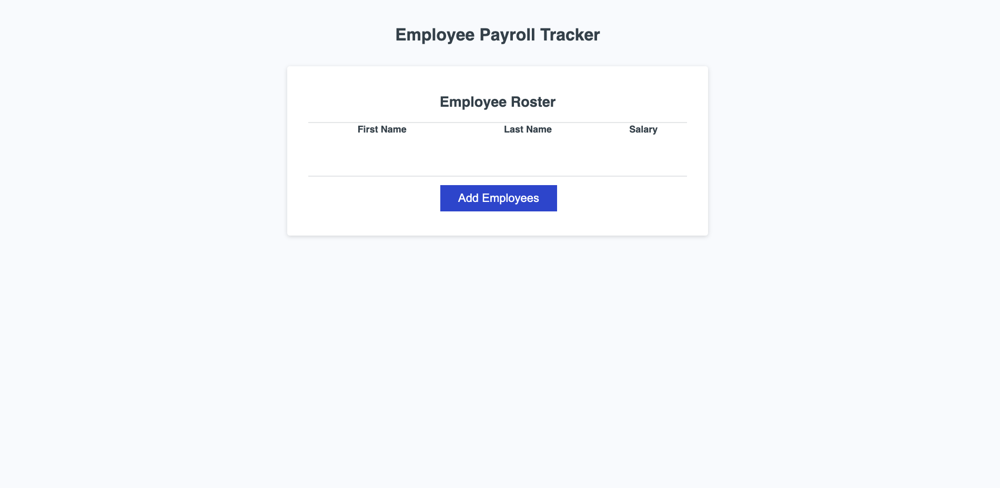

# Employee Payroll Tracker
Payroll App that allows a manager to view and control payroll data

## Motivation

My motivation with this project is to showcase the applications ability to simplify and organize the proccess of submiting payroll information. 

## What does it solve and provide?
This application will help managment teams keep track and organized payroll for their houlry teammembers. This feature will simplify payroll and reduce the effort and time the managers will need to produce this task. 

## Features
This webisite portfolio offers five examples of projects that I have finsihed with the help of UCF's coding bootcamp. The five examples showcase my ability with Mern Stack, Node, React, JavaSrcipt, HTML, CSS, and Mern Stack.         

 ## Installation 
 Clone the respository to your Github account and deploy the website once finished and approved code. 
 
 Website Link: https://brandondell.github.io/employeePayrollTracker/

 ## Image
 

 ## Credits
 -UCF Coding Bootcamp Coures.
 -Tutor Chris helped me with debugin average salary, Math.floor section, and get random person 
 

 ## License
 N/A